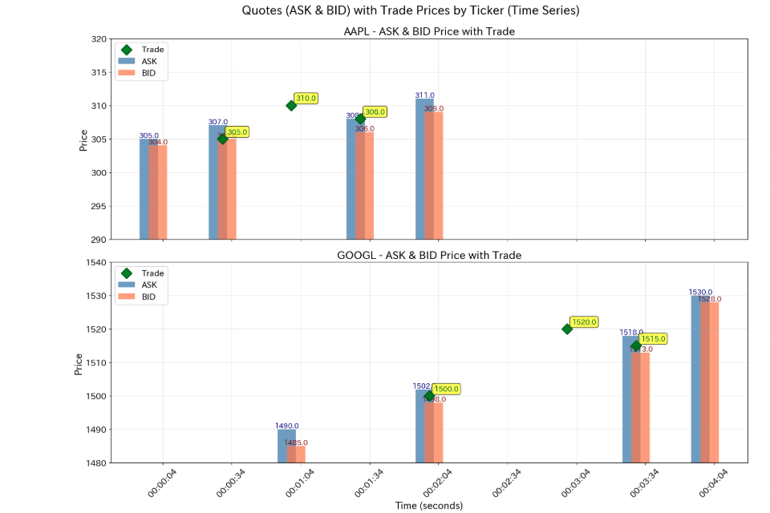

## お題

> **Time to try out this ASOF join that they've introduced to Snowflake!**
> 
> In the heart of a bustling financial district lies a brokerage firm's trading floor, where traders make split-second decisions amid a frenzy of activity. Trades and quotes, recorded in separate tables, hold vital information about transactions and market prices.
> 
> > To ensure traders have the latest market data, a critical task emerges: pairing each trade with the most recent quote available at or before its time. Analysts devise a sophisticated SQL query, leveraging temporal joins to seamlessly integrate trade and quote data based on timestamps.
> 
> Given two tables, trade and quotes, containing transactional data in a financial market, where the trade table records trades and the quotes table records quotes for a specific financial instrument, construct an ASOF join SQL statement to pair each trade record with the most recent quote record available at or before the time of the trade.

**Snowflake に導入された ASOF JOIN を試してみましょう！**

活気ある金融街の中心に、証券会社のトレーディングフロアがあります。そこではトレーダーが熱狂的な活動の中で瞬時に意思決定を行っています。取引（trade）と気配値（quote）は別々のテーブルに記録されており、トランザクションと市場価格に関する重要な情報を保持しています。

トレーダーが最新の市場データを確実に入手できるようにするため、重要なタスクが生じます。それは、各取引を、その取引時刻以前の最も直近の気配値とペアリングすることです。アナリストは、タイムスタンプに基づいて取引データと気配値データをシームレスに統合するために、時間的結合を活用した高度な SQL クエリを考案します。

金融市場の取引データを含む2つのテーブル（trade と quotes）が与えられます。trade テーブルには取引が記録され、quotes テーブルには特定の金融商品の気配値が記録されています。各取引レコードを、取引時刻以前の最も直近の気配値レコードとペアリングする ASOF JOIN の SQL 文を作成してください。

## データの確認



## ASOF Join を使わない場合の処理内容

ASOF JOIN を使わずに同じ結果を得るには、ウィンドウ関数を活用します。

### 処理の流れ

#### 1. 条件付き結合（INNER JOIN）

`trade` テーブルと `quotes` テーブルを、以下の2つの条件で結合します。

- 同じ銘柄（`ticker`）
- 気配値の時刻が取引時刻以前（`q.datetime <= t.datetime`）

**この段階では、1つの取引に対して複数の気配値レコードが結びつきます。**

```
【例】取引 AAPL 10:15 に対して、3つの気配値（10:00, 10:10, 10:14）が結合される

trade テーブル                quotes テーブル
┌──────┬────────┐           ┌──────┬────────┬─────┬─────┐
│ticker│datetime│           │ticker│datetime│ bid │ ask │
├──────┼────────┤           ├──────┼────────┼─────┼─────┤
│ AAPL │  10:15 │───┐       │ AAPL │  10:00 │ 150 │ 151 │
└──────┴────────┘   │       │ AAPL │  10:10 │ 152 │ 153 │
                    └─JOIN──│ AAPL │  10:14 │ 153 │ 154 │
                            │ AAPL │  10:20 │ 155 │ 156 │ ← 除外（10:15より後）
                            └──────┴────────┴─────┴─────┘

↓ INNER JOIN の結果（中間レコード）

┌──────┬──────────────┬──────────────┬─────┬─────┐
│ticker│trade_datetime│quote_datetime│ bid │ ask │
├──────┼──────────────┼──────────────┼─────┼─────┤
│ AAPL │       10:15  │       10:00  │ 150 │ 151 │
│ AAPL │       10:15  │       10:10  │ 152 │ 153 │
│ AAPL │       10:15  │       10:14  │ 153 │ 154 │ ← 最新（これを選びたい）
└──────┴──────────────┴──────────────┴─────┴─────┘
```

#### 2. ランク付け（ROW_NUMBER）

各取引（`PARTITION BY t.id, t.datetime`）ごとに、結びついた気配値を時刻の降順（`ORDER BY q.datetime DESC`）でランク付けします。

```
↓ ROW_NUMBER() を追加

┌──────┬──────────────┬──────────────┬─────┬─────┬────┐
│ticker│trade_datetime│quote_datetime│ bid │ ask │ rn │
├──────┼──────────────┼──────────────┼─────┼─────┼────┤
│ AAPL │       10:15  │       10:14  │ 153 │ 154 │  1 │ ← 最新
│ AAPL │       10:15  │       10:10  │ 152 │ 153 │  2 │
│ AAPL │       10:15  │       10:00  │ 150 │ 151 │  3 │
└──────┴──────────────┴──────────────┴─────┴─────┴────┘
```

#### 3. 最新の気配値のみを選択（WHERE rn = 1）

`rn = 1` のレコードのみをフィルタリングします。

```
↓ WHERE rn = 1 でフィルタ

┌──────┬──────────────┬──────────────┬─────┬─────┐
│ticker│trade_datetime│quote_datetime│ bid │ ask │
├──────┼──────────────┼──────────────┼─────┼─────┤
│ AAPL │       10:15  │       10:14  │ 153 │ 154 │ ✓ 最終結果
└──────┴──────────────┴──────────────┴─────┴─────┘
```

### まとめ

この方法により、ASOF JOIN と同等の「各取引時刻以前で最も新しい気配値」を取得できます。

ただし、ASOF JOIN を使った方がコードが簡潔で、実行効率も良い場合があります。
